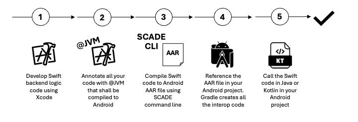

# Develop Android Apps with Swift in 5 simple steps
This chapter describes how to develop and use Swift 6.x code across iOS and Android and drastically reduce your development time. This chapter provides a quick overview and is not meant as a development guide. See our HelloWorld development guide for details.




## 1. Develop application logic code
Application logic refers to the non-UI components of a mobile application—the parts that handle data processing, business rules, and state management. In MVVM architecture, this typically includes the Model and ViewModel layers. You develop all this code from your XCode IDE.

## 2. Annotate all Swift code with @JVM
You use the @JVM annotation on your source code to define what code shall be compiled to Android. You can use the @JVM annotation on all kind of Swift objects like Class, Enum or Struct.


```swift
import Swift4j // import @jvm macro and supporting types 

// @jvm automatically exposes the annoted class together with
// all methods that can be exposed
@jvm 
public class GreetingService {
  func greet(name: String, _ response: (String) -> Void) {        
    response("Swift greets \(name)")
  }
}
```
## 3. Compile the code using SCADE CLI
You then use the SCADE CLI to compile the code into an AAR file.

## 4. Reference the AAR file in Android Studio, create interop code
In Android Studion, you then reference the AAR file using our SCADE gradle plugin

```groovy
plugins {
  id("io.scade.gradle.plugins.swiftpm") version "1.0.3" 
}
```
## 5. Call the Swift code using Kotlin or Java
The Swift code is now ready to be used on Android

```swift
import swift4j_examples.GreetingService

// The Swift dynamic library has to be loaded once prior
// the use of any exposed type  
System.loadLibrary("swift4-examples")

// Create an instance of the exposed class 
val greetings = GreetingService()
// And call the 'greet' method passing a Kotlin lambda  
greetings.greet("Android") { resp ->
  print(resp)    
}
// Output: Swift greets Android!
```
