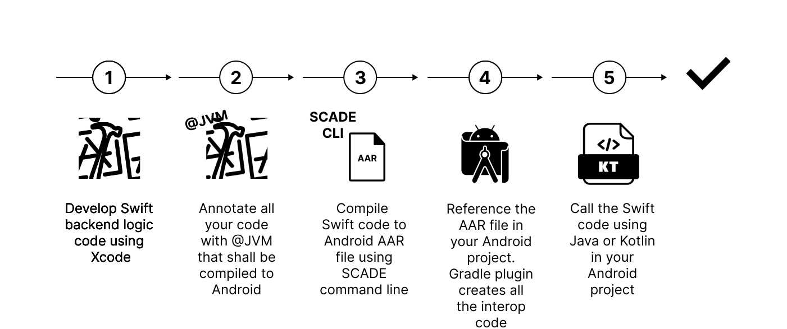

# Develop Android Apps with Swift in 4 simple steps



## 1. Develop application logic code
Application logic refers to the non-UI components of a mobile application—the parts that handle data processing, business rules, and state management. In MVVM architecture, this typically includes the Model and ViewModel layers. You develop all this code from your Xcode IDE.

## 2. Annotate all Swift code with @JVM
You use the @JVM annotation on your source code to define what code shall be compiled to Android. You can use the @JVM annotation on all kind of Swift objects like Class, Enum or Struct.


```swift
import Swift4j // import @jvm macro and supporting types

// @jvm automatically exposes the annoted class together with
// all methods that can be exposed
@jvm
public class GreetingService {
  func greet(name: String, _ response: (String) -> Void) {
    response("Swift greets \(name)")
  }
}
```
## 3. Reference the Swift source in Android Studio and compile to Android
Install the SCADE Swift Gradle plugin that manages the compilation process

```groovy
plugins {
  id("io.scade.gradle.plugins.swiftpm") version "1.0.3"
}
```
and reference the Swift code (the XCode source projects)

```groovy
swiftpm {
  // Path to the Swift package
  path = file("<PACKAGE LOCATION>")
  // Name of the package's product (dynamic) containing exposed Swift targets
  product = "<PRODUCT NAME>"
}
```
Once you build your Android project, SCADE will compile the Swift source, create an AAR file and include it automatically in the Android project.

## 4. Call the Swift code using Kotlin or Java
The Swift code is now ready to be used on Android

```swift
import swift4j_examples.GreetingService

// The Swift dynamic library has to be loaded once prior
// the use of any exposed type
System.loadLibrary("swift4-examples")

// Create an instance of the exposed class
val greetings = GreetingService()
// And call the 'greet' method passing a Kotlin lambda
greetings.greet("Android") { resp ->
  print(resp)
}
// Output: Swift greets Android!
```
