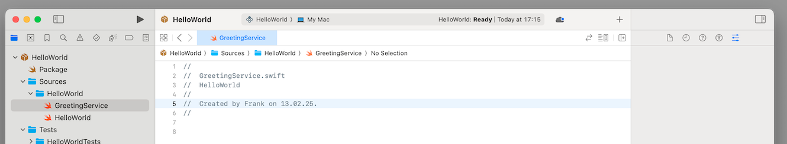
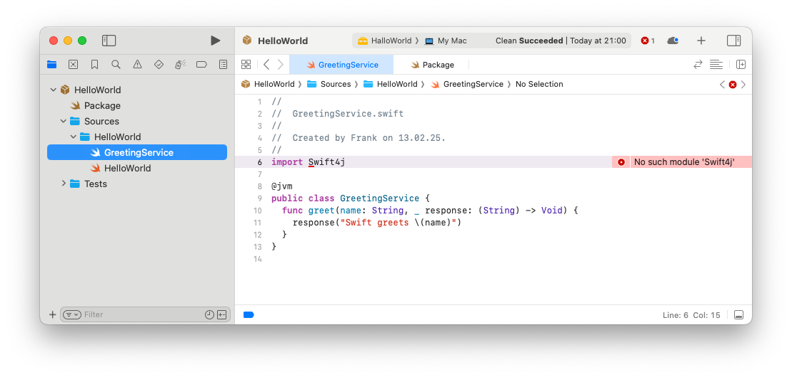

## Goals
- Develop minimal Swift for Android app 
- that uses Swift code written in Xcode
- show in detail the important steps common to each project


# Develop in Xcode

## Create Xcode project directory
1. Create directory **HelloWorld** that contains your Swift library

```bash filename="Terminal"
./Projects % mkdir HelloWorld
```
## Create Xcode project 
2. Create an Xcode project that contains your shared code

```swift
swift package init --type library --name HelloWorld
```
Make sure to use it from  **inside** your project directory

```bash filename="Terminal"
./Projects/HelloWorld  % swift package init --type library --name HelloWorld
```
As a result you see

```bash filename="Terminal"
Creating library package: HelloWorld
Creating Package.swift
Creating .gitignore
Creating Sources/
Creating Sources/HelloWorld/HelloWorld.swift
Creating Tests/
Creating Tests/HelloWorldTests/
Creating Tests/HelloWorldTests/HelloWorldTests.swift\
```
## Open project in Xcode and add first Swift class

3. Open project in Xcode

4. Create Swift class called **GreetingService**

	```swift
	public class GreetingService {
	  func greet(name: String, _ response: (String) -> Void) {        
	    response("Swift greets \(name)")
	  }
	}
	```
	
	- This is a very simple class with a function greet
	- Function greet has two argument
		- **name**: a variale of type string
		- **response**: a variable of type closure 
	- the function executes the closure using the name argument as a input

## Add @jvm to compile the class to Android
Now we make the changes to be able to compile the class to Android

5. Add **@jvm** to the classes you want to compile to Android. In our case here, we add **@jvm** to the GreetingService class

6. The **@jvm** annotation is part of the Swift4J library. Please import Swift4J using **import Swift4j** (pay attention to the smaller case j)

```swift
import Swift4j

@jvm
public class GreetingService {
  func greet(name: String, _ response: (String) -> Void) {
    response("Swift greets \(name)")
  }
}
```
7. As you can see, Xcode is complaining about the missing module Swift4J ("No such module Swif4J")



## Add Swift4J dependency in package.swift
To fix the compile errors and compile the Swift project, you now need to add the necessary dependencies and modify the **package.swift** as described here.

The steps describe the necessary changes. Either carefully make the changes yourself for learning and training purposes to the existing package.swift or alternative copy and replace the package.swift from the code snippet at the bottom.

8. Change 1: Add a **platform** with minimum version
This is not included by default.

	```swift
	   platforms: [
	        .macOS(.v13)
	       ],
	```
This ensures a minimum version and avoids compiler errors. 

9. Change 2: You need to set the **library target type** to **dynamic**:

	```swift
	   type: .dynamic,
	```

	This is due to limitations of JNI. Only Swift targets that are parts of dynamic libraries can be accessed from Java/Kotlin.

10. Change 3: add a dependency on the swift4j package into the Package.swift file

	```swift
	  dependencies: [
	    .package(url: "https://github.com/scade-platform/swift4j.git", from: "1.0.0")
	  ]
	```
	
11. Change 4:  add the Swift4j package as a dependency to our **target**

	```swift
	.target(
	  ...
	  dependencies: [
	    .product(name: "Swift4j", package: "swift4j")              
	  ]
	)
	```

The entire updated package file now looks like below. Insteaf of making the changes yourself, you might copy the entire code into Xcode package.swift file.

```swift

// swift-tools-version: 5.10
// The swift-tools-version declares the minimum version of Swift required to build this package.
 
import Foundation
import PackageDescription
 
let package = Package(
        // Package.swift
 
    name: "HelloWorld",
    
    // Change 1 - add at least a target with version > .v13
    platforms: [
        .macOS(.v13)
       ],
    
    products: [
        .library(
            name: "HelloWorld",
            
            // Change 2 - add at least a target with version > .v13
            type: .dynamic,
            
            
            targets: ["HelloWorld"])
    ],
 
    dependencies: [
      //  Change 3  - we use the Swift4j package to mark the Swift code that should be available on Android as Java API
        .package(url: "https://github.com/scade-platform/swift4j.git", from: "1.2.1")
    ],
 
    targets: [
        .target(
            name: "HelloWorld",
            dependencies: [
             
                // Change 4:  We add the Swift4j package as a dependency to our target
              .product(name: "Swift4j", package: "swift4j")
            ]
        )
    ]
)
```

## Build should now be successful
Your build should now be successful. In some cases, you also need to give permission to access the Swift4j library. You can do this using Xcode by clicking on the error message and approving the library.


# Reuse and develop in Android Studio

## 


