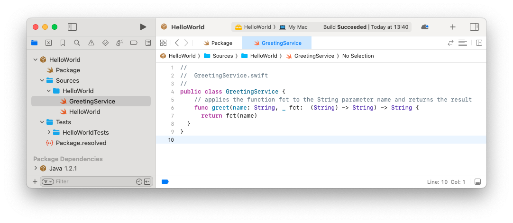
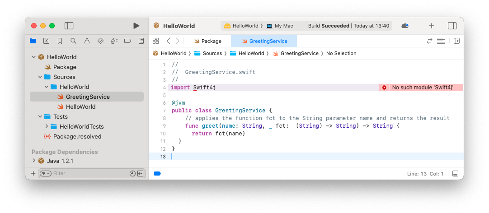
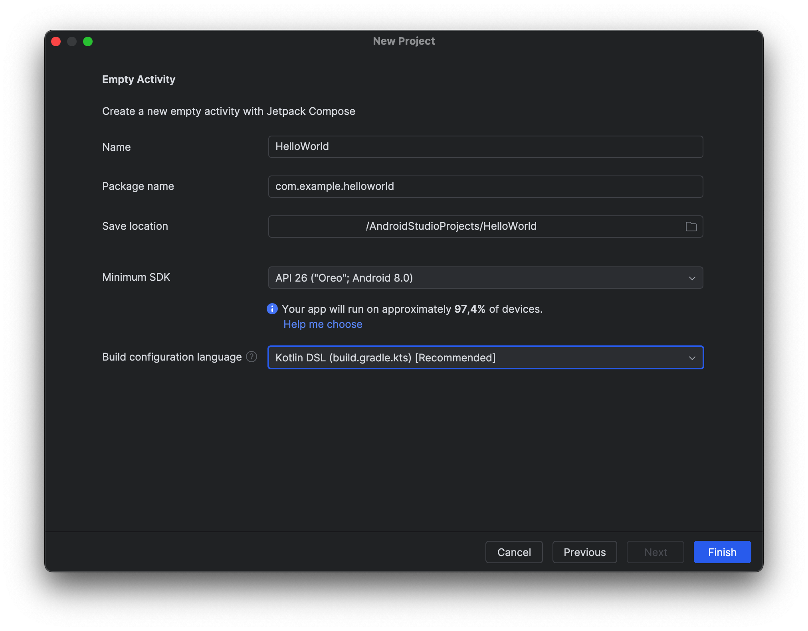
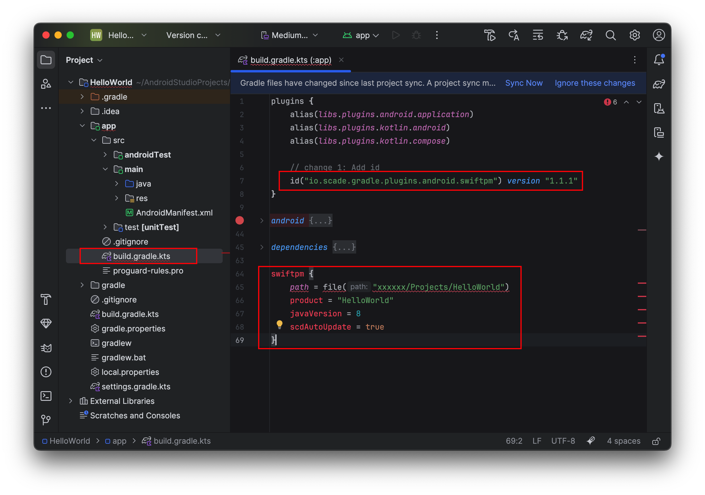
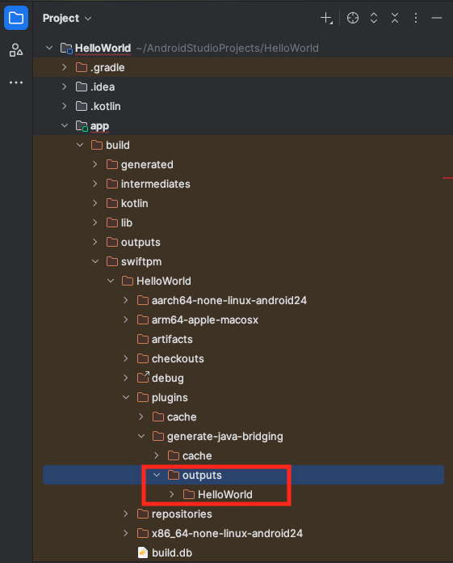
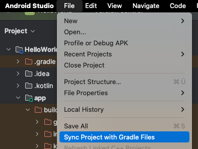
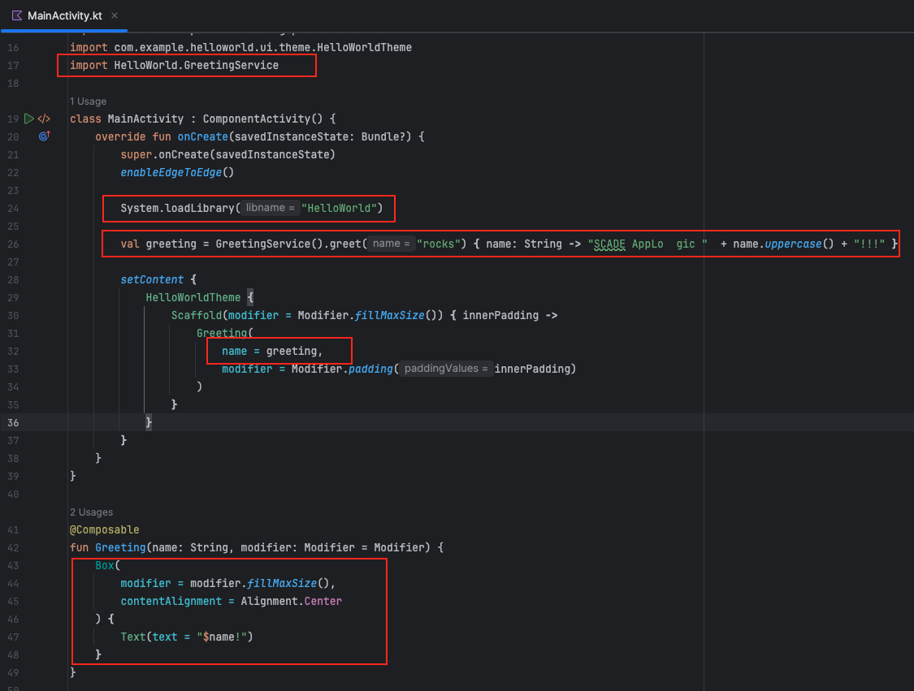
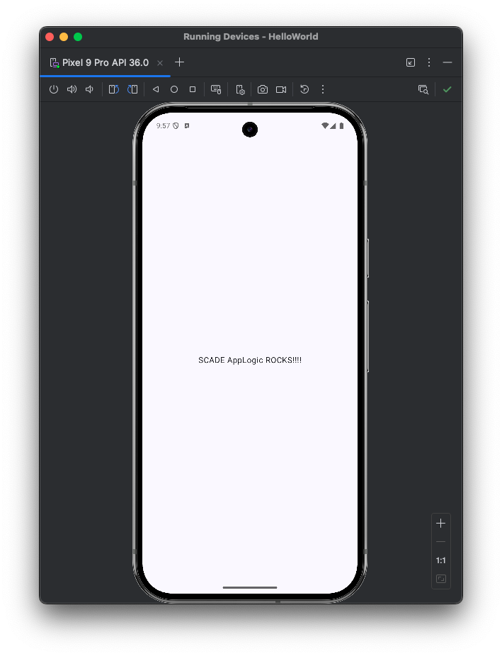

## Overview
The HelloWorld example shows how to develop a simple Swift class in Xcode, compile it to a native Android library, and very easily call the code in Android Studio. 

| Functionality used | Technology used |
|:-------------------|:----------------|
| • Call methods of a Swift class  <br/>• Pass closures |• Swift Android compiler <br/>• Swift4J   |

The HelloWorld tutorial is extremely detailed. Please ensure you understand each step. In other tutorials, we will omit some instructions to avoid instruction bloat. 

## Develop in Xcode

### Create Xcode project directory
1. Create a directory **HelloWorld** that contains your Swift library. Let's refer to this as the project directory.

	```bash filename="Terminal"
	./Projects % mkdir HelloWorld
	```

### Create Xcode project
2. Create an Xcode project that contains your shared code:

	```swift
	swift package init --type library --name HelloWorld
	```
Make sure to use it from **inside** your project directory:

	```bash filename="Terminal"
	./Projects/HelloWorld  % swift package init --type library --name HelloWorld
	```

As a result, you see:

	```bash filename="Terminal"
	Creating library package: HelloWorld
	Creating Package.swift
	Creating .gitignore
	Creating Sources/
	Creating Sources/HelloWorld/HelloWorld.swift
	Creating Tests/
	Creating Tests/HelloWorldTests/
	Creating Tests/HelloWorldTests/HelloWorldTests.swift
	```

### Open project in Xcode and add first Swift class

3. Open the project in Xcode.

4. Create a Swift class called **GreetingService**:

	```swift
	public class GreetingService {
	    // applies the function fct to the String parameter name and returns the result
	    func greet(name: String, _ fct:  (String) -> String) -> String {
	      return fct(name)
	  }
	}
	```

	- This is a very simple class with a function `greet`.
	- Function `greet` has two arguments:
		- **name**: a variable of type `String`
		- **fct**: a variable of type closure
	- The function executes the closure using the `name` argument as an input and returns a `String`.



### Add @jvm to compile the class to Android
Now we make the changes to be able to compile the class to Android.

5. Add **@jvm** to the classes you want to compile to Android. In our case here, we add **@jvm** to the `GreetingService` class.

6. Import Swift4J using **import Swift4j** (pay attention to the lowercase **j**). The @jvm annotation is part of the Swift4J library.

	```swift
	import Swift4j

	@jvm
	public class GreetingService {
	    // applies the function fct to the String parameter name and returns the result
	    func greet(name: String, _ fct:  (String) -> String) -> String {
	      return fct(name)
	  }
	}
	```

7. As you can see, Xcode is complaining about the missing module Swift4J ("No such module Swift4J").



### Add Swift4J dependency in package.swift
To fix the compile errors and compile the Swift project, you now need to add the necessary dependencies and modify the **Package.swift** as described here.

The steps describe the necessary changes. Either carefully make the changes yourself for learning and training purposes to the existing Package.swift or alternatively copy and replace the Package.swift from the code snippet at the bottom.

8. Change 1: Add a **platform** with minimum version (not included by default):

	```swift
	   platforms: [
	        .macOS(.v13)
	       ],
	```

	This ensures a minimum version and avoids compiler errors.

9. Change 2: You need to set the **library target type** to **dynamic**:

	```swift
	   type: .dynamic,
	```

	This is due to limitations of JNI. Only Swift targets that are part of dynamic libraries can be accessed from Java/Kotlin.

10. Change 3: Add a dependency on the Swift4J package into the `Package.swift` file:

	```swift
	  dependencies: [
	    .package(url: "https://github.com/scade-platform/swift4j.git", from: "1.2.1")
	  ]
	```

11. Change 4: Add the Swift4J package as a dependency to our **target**:

	```swift
	.target(
	  ...
	  dependencies: [
	    .product(name: "Swift4j", package: "swift4j")
	  ]
	)
	```

The entire updated `Package.swift` file should now look like below:

	```swift
	// swift-tools-version: 5.10
	// The swift-tools-version declares the minimum version of Swift required to build this package.
	
	import Foundation
	import PackageDescription
	
	let package = Package(
	    name: "HelloWorld",
	
	    platforms: [
	        .macOS(.v13)
	       ],
	
	    products: [
	        .library(
	            name: "HelloWorld",
	            type: .dynamic,
	            targets: ["HelloWorld"])
	    ],
	
	    dependencies: [
	        .package(url: "https://github.com/scade-platform/swift4j.git", from: "1.2.1")
	    ],
	
	    targets: [
	        .target(
	            name: "HelloWorld",
	            dependencies: [
	              .product(name: "Swift4j", package: "swift4j")
	            ]
	        )
	    ]
	)
	````

### Build should now be successful

Your build should now be successful. In some cases, you also need to give permission to access the Swift4J library. You can do this in Xcode by clicking on the error message and approving the library.

## Share Swift code and develop on Android Studio

<Callout type="warn">
Please ensure that the Android NDK is installed. See also Installation > Android NDK
</Callout>

### Create new Android project

13. Choose **File > New Project**
14. Choose **Empty Activity**
15. Call the project **HelloWorld**

    * Choose **Kotlin DSL** as build configuration language



### Setup the gradle config file in the app directory

16. Open the **build.gradle.kts** file in the <span style={{ fontWeight: 'bold', color:'red' }}>app directory</span>

* There is a 2nd `build.gradle.kts` outside of the app directory. Don’t use that one.

17. Add the SCADE Swift Product Manager **plugin** under plugins:

    ```gradle
    id("io.scade.gradle.plugins.android.swiftpm") version "1.1.1"
    ```

18. Add the SCADE Swift Product Manager **configuration** at the bottom of the file:

    ```gradle
    swiftpm {
        path = file("<fullpath>/Projects/HelloWorld")
        product = "HelloWorld"
        javaVersion = 8
        scdAutoUpdate = true
    }
    ```

    * The **path** needs to point to the directory of the Swift project (see step 1).
    * Set the **product** to "HelloWorld".



### Build and run the project to see it's working

19. Build the project. When you run the build for the first time, it downloads all dependencies and compiles the source code. This could **take 2–3 minutes**. Subsequent builds will be much faster.

    Once the build has succeeded, you can find the Java interop code here:
    

20. To test the setup., run the Android app in the simulator. You have to assign a simulator in Android Studio and configure a run file. This step is not described in detail here, as these are basic Android development steps.

	<Callout type="warn">
	If your run button in Android Studio is grayed out, this is an Android Studio issue and you need to restart Android Studio. 
	</Callout>
	

### Invoke Swift logic from Android UI

By now, we compiled Swift code to Android. We included the resulting library called HelloWorld in the Android project and had SCADE generate the interop code. We now can bind the logic to the UI.

21. Import the code using the **import** command. Add:
		
	```kotlin
	import HelloWorld.GreetingService
	```

	If Android Studio cannot find the namespace or class and autocompletion does not work, use the **Sync Project with Gradle File** menu from Android Studio.
	
	 


22. Add the line **System.loadLibrary("HelloWorld")** in the `onCreate` method to load the HelloWorld library.

	```kotlin
	class MainActivity : ComponentActivity() {
	    override fun onCreate(savedInstanceState: Bundle?) {
	        super.onCreate(savedInstanceState)
	        enableEdgeToEdge()
	
	        System.loadLibrary("HelloWorld")
	```
	
	This loads your Swift code into memory and the code is ready to use.

23. Finally, call the Swift code. SCADE produces extremely powerful interop code. Calling our **greet** method developed in Swift code is extremely easy. Add the following code in the next line:
	
	```kotlin
	val greeting = GreetingService().greet("rocks")
		 { name: String -> "SCADE AppLogic " + name.uppercase() + "!!!" }
	```
	
	* First, we instantiate the `GreetingService`.
	* Then we call the **greet** method with parameter `name` set to `"rocks"`.
	* We then pass in the closure:
	  * The closure takes a `String` as input, converts it to uppercase, and concatenates it with two `String` constants.
	  * The closure then returns the result.
	* We store the result in a variable `greeting`.
	
	Great! So we coded our first call to a Swift method in Android. 

24. Bind the `greeting` variable into the UI text label. In the **setContent** code, set `name = greeting`.

	```kotlin
	setContent {
	    HelloWorldTheme {
	        Scaffold(modifier = Modifier.fillMaxSize()) { innerPadding ->
	            Greeting(
	                name = greeting,
	                modifier = Modifier.padding(innerPadding)
	            )
	        }
	    }
	}
	```

	As a final (optional) step, we make the UI more beautiful by centering the label. Replace the **Greeting function** with the following code:
	
	```kotlin
	@Composable
	fun Greeting(name: String, modifier: Modifier = Modifier) {
	    Box(
	        modifier = modifier.fillMaxSize(),
	        contentAlignment = Alignment.Center
	    ) {
	        Text(text = "$name!")
	    }
	}
	```

	This centers the text control by introducing a `Box` control.

	**	We are done coding !**
	
Here’s the full code for `MainActivity.kt`:



```kotlin
package com.example.helloworld

import androidx.compose.foundation.layout.Box
import androidx.compose.foundation.layout.fillMaxSize
import androidx.compose.ui.Alignment
import android.os.Bundle
import androidx.activity.ComponentActivity
import androidx.activity.compose.setContent
import androidx.activity.enableEdgeToEdge
import androidx.compose.foundation.layout.padding
import androidx.compose.material3.Scaffold
import androidx.compose.material3.Text
import androidx.compose.runtime.Composable
import androidx.compose.ui.Modifier
import androidx.compose.ui.tooling.preview.Preview
import com.example.helloworld.ui.theme.HelloWorldTheme
import HelloWorld.GreetingService

class MainActivity : ComponentActivity() {
    override fun onCreate(savedInstanceState: Bundle?) {
        super.onCreate(savedInstanceState)
        enableEdgeToEdge()

        System.loadLibrary("HelloWorld")

        val greeting = GreetingService().greet("rocks") { name: String -> "SCADE AppLogic " + name.uppercase() + "!!!" }

        setContent {
            HelloWorldTheme {
                Scaffold(modifier = Modifier.fillMaxSize()) { innerPadding ->
                    Greeting(
                        name = greeting,
                        modifier = Modifier.padding(innerPadding)
                    )
                }
            }
        }
    }
}

@Composable
fun Greeting(name: String, modifier: Modifier = Modifier) {
    Box(
        modifier = modifier.fillMaxSize(),
        contentAlignment = Alignment.Center
    ) {
        Text(text = "$name!")
    }
}

@Preview(showBackground = true)
@Composable
fun GreetingPreview() {
    HelloWorldTheme {
        Greeting("Android")
    }
}
```


25. Run your first cross-platform native Swift app
    Press the run button and see the application running: blaba

	
