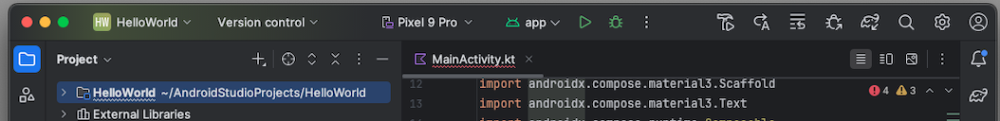

## Overview
The HelloWorld example shows how to develop a simple Swift class in Xcode, compile it to a native Android library, and very easily call the code in Android Studio. 
| Functionality used | Technology used |
|:----------|:----------|
| • Call methods of a Swift class  <br/>• Pass closures |• Swift Android compiler <br/>• Swift4J   |

## Develop in Xcode

### Create Xcode project directory
1. Create directory **HelloWorld** that contains your Swift library. Lets refer to this as project directory.

	```bash filename="Terminal"
	./Projects % mkdir HelloWorld
	```

### Create Xcode project
2. Create an Xcode project that contains your shared code

	```swift
	swift package init --type library --name HelloWorld
	```
Make sure to use it from  **inside** your project directory

	```bash filename="Terminal"
	./Projects/HelloWorld  % swift package init --type library --name HelloWorld
	```
As a result you see

	```bash filename="Terminal"
	Creating library package: HelloWorld
	Creating Package.swift
	Creating .gitignore
	Creating Sources/
	Creating Sources/HelloWorld/HelloWorld.swift
	Creating Tests/
	Creating Tests/HelloWorldTests/
	Creating Tests/HelloWorldTests/HelloWorldTests.swift\
	```
### Open project in Xcode and add first Swift class

3. Open project in Xcode

4. Create Swift class called **GreetingService**

	```swift
	public class GreetingService {
	    // applies the function fct to the String parameter name and returns the result
	    func greet(name: String, _ fct:  (String) -> String) -> String {
	      return fct(name)
	  }
	}
	```

	- This is a very simple class with a function greet
	- Function greet has two argument
		- **name**: a variale of type string
		- **fct**: a variable of type closure
	- the function executes the closure using the name argument as a input and returns a string

 
### Add @jvm to compile the class to Android
Now we make the changes to be able to compile the class to Android

5. Add **@jvm** to the classes you want to compile to Android. In our case here, we add **@jvm** to the GreetingService class

6.  Please import Swift4J using **import Swift4j** (pay attention to the smaller case j). The @jvm annotation is part of the Swift4J library.

	```swift
	import Swift4j

	@jvm
	public class GreetingService {
	    // applies the function fct to the String parameter name and returns the result
	    func greet(name: String, _ fct:  (String) -> String) -> String {
	      return fct(name)
	  }
	}
	```
7. As you can see, Xcode is complaining about the missing module Swift4J ("No such module Swif4J")

 

### Add Swift4J dependency in package.swift
To fix the compile errors and compile the Swift project, you now need to add the necessary dependencies and modify the **package.swift** as described here.

The steps describe the necessary changes. Either carefully make the changes yourself for learning and training purposes to the existing package.swift or alternative copy and replace the package.swift from the code snippet at the bottom.

8. Change 1: Add a **platform** with minimum version
This is not included by default.

	```swift
	   platforms: [
	        .macOS(.v13)
	       ],
	```
	This ensures a minimum version and avoids compiler errors.

9. Change 2: You need to set the **library target type** to **dynamic**:

	```swift
	   type: .dynamic,
	```

	This is due to limitations of JNI. Only Swift targets that are parts of dynamic libraries can be accessed from Java/Kotlin.

10. Change 3: add a dependency on the swift4j package into the Package.swift file

	```swift
	  dependencies: [
	    .package(url: "https://github.com/scade-platform/swift4j.git", from: "1.2.1")
	  ]
	```

11. Change 4:  add the Swift4j package as a dependency to our **target**

	```swift
	.target(
	  ...
	  dependencies: [
	    .product(name: "Swift4j", package: "swift4j")
	  ]
	)
	```

The entire updated package.swift file show now look like below. Instead of making the changes yourself, you might copy the entire code into Xcode package.swift file.

```swift

// swift-tools-version: 5.10
// The swift-tools-version declares the minimum version of Swift required to build this package.

import Foundation
import PackageDescription

let package = Package(
        // Package.swift

    name: "HelloWorld",

    // Change 1 - add at least a target with version > .v13
    platforms: [
        .macOS(.v13)
       ],

    products: [
        .library(
            name: "HelloWorld",

            // Change 2 - add at least a target with version > .v13
            type: .dynamic,


            targets: ["HelloWorld"])
    ],

    dependencies: [
      //  Change 3  - we use the Swift4j package to mark the Swift code that should be available on Android as Java API
        .package(url: "https://github.com/scade-platform/swift4j.git", from: "1.2.1")
    ],

    targets: [
        .target(
            name: "HelloWorld",
            dependencies: [

                // Change 4:  We add the Swift4j package as a dependency to our target
              .product(name: "Swift4j", package: "swift4j")
            ]
        )
    ]
)
```

### Build should now be successful
Your build should now be successful. In some cases, you also need to give permission to access the Swift4j library. You can do this using Xcode by clicking on the error message and approving the library.


## Share Swift code and develop on Android Studio

<Callout type="warn">
Please ensure that the Android NDK is installed. See also Installation > Android NDK
</Callout>

### Create new Android project
13. Choose **File > New Project**
14. Choose **Empty Activity**
15. Call the project **HelloWorld**
	- Choose **Kotlin DSL** as build configuration language


### Setup the gradle config file in the app directory
16. Open the **build.gradle.kts** file in the <span style={{ fontWeight: 'bold', color:'red' }} >app directory</span> directory
 - There is a 2nd build.gradle.kts outside of the app directory. Dont use that one

17. Add the SCADE Swift Product Manager **plugin** under plugins

	```gradle
	id("io.scade.gradle.plugins.android.swiftpm") version "1.1.1"
	```
18. Add the SCADE Swift Product Manager **configuration** at the bottom of the file

	```gradle
	swiftpm {
	    path = file("<fullpath>/Projects/HelloWorld")
	    product = "HelloWorld"
	    javaVersion = 8
	    scdAutoUpdate = true
	}
	```

	 - the **path** needs to point to the directory of the Swift project. See step 1
	 - set the **product** to "HelloWorld"

	

### Build and run the project to see its working
19. Buld the project. When you run the build for the first time, it downloads all dependencies and compiles the source code. This could **take 2-3 minutes**. Subsequent build will be much faster.

	Once the build has succeded, you can find the Java interop code here 
	


20. Run the Android Project
Please run the Android project. You have to assign a simular and configure a run file. 
	
	<Callout type="warn">
	If your run button in Android Studio is grayed out, this is an Android Studio issue and you need to restart Android Studio. 
	</Callout>
	
	

### Invoke Swift logic from Android UI 
By now, we compiled Swift code to Android. We included the resulting library called HelloWorld in the Android project and had SCADE generate the interop code. We now can bind the logic to the UI

22. Add code to load the library
	
	Add the line **System.loadLibrary("HelloWorld")** in the onCreate method to load the HelloWorld library.

	```kotlin
class MainActivity : ComponentActivity() {
    override fun onCreate(savedInstanceState: Bundle?) {
        super.onCreate(savedInstanceState)
        enableEdgeToEdge()

        System.loadLibrary("HelloWorld")
	```
	
	This loads your Swift code into memory and the code is ready to use.
	
22. Finally, call the Swift code 

	SCADE interop functionality produces extremely powerful interop code. Calling our **greet** method develoepd in Swift code is extremely easy. Add the following code in the next line:
	
	```kotlin
        val greeting = GreetingService().greet("rocks") { name: String -> "SCADE AppLo  gic "  + name.uppercase() + "!!!" }
	```

	- First we instantiate the GreetingService 
	- then we call the **greet** method with paramter name set to "rocks"
	- we then pass in the closure
		- the closure takes a String as an input, converts into to uppercase cand oncatenates it with two String constants
		- the closure then returns the result
	- we store the result in a variable greeting
		
	Great, so we coded our first call to a Swift method in Android.

23. Bind the variable to the UI Text label
Bind the greeting variable into the UI. In the **setContent** code, set name to the variable greeting (name = greeting)

	```kotlin
    setContent {
        HelloWorldTheme {
            Scaffold(modifier = Modifier.fillMaxSize()) { innerPadding ->
                Greeting(
                    name = greeting,
                    modifier = Modifier.padding(innerPadding)
                )
            }
        }
    }
	```

	As a final (optional) step, we make the UI more beautiful by centering the label. Replace the fun **Greeting function** with the following code
	
	```kotlin
	@Composable
	fun Greeting(name: String, modifier: Modifier = Modifier) {
	    Box(
	        modifier = modifier.fillMaxSize(),
	        contentAlignment = Alignment.Center
	    ) {
	        Text(text = "$name!")
	    }
	}
	```
	This centers the Text control by introducing a Box control
	


