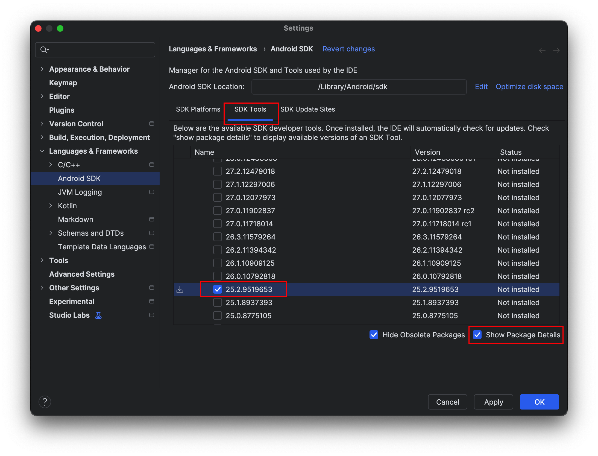

## Prerequisites
| Component        | Min                 | Max                 |
|:------------------|:---------------------|:---------------------|
| Swift            | 5.8                 | 6.1.2               |
| macOS            | 13.0                | 15.4                |
| Xcode            | 14.3                | 16.4                |
| Android version  | Android 10 (API 29) | Android 16 (API 36) |
| Android NDK      | 25                  | 25                  |

### IDE installations
- We assume that you have Apple Xcode installed
- We assume that you have Android Studio installed

### Install Android NDK
Android developers might not have installed the Android NDK which is necessary for mobile app development. 

If you havent installed Android NDK version (see above),please follow these instructions.

1. In Android Studio, choose **Tools > SDK Manager**
2. Click on the **SDK Tools** tab
3. Click on **Show Package details**
4. Scroll down to **NDK (Side by Side)** and choose NDK version
5. Press OK for installation

## Installation
There is no manual installation necessary. 

You as the developer **don't have to manually install anything**. The toolchain and libraries are automatically pulled from SCADE github site when you add the library dependencies in Xcode and Android Studio and start the build process.
 
Just remember that when you build a project the very first time, it takes 1 - 2 minutes to download all the dependencies. 
## Components
Here is the list of components installed as part of the SCADE platform

On Xcode

- Compiler plugin (to provide error messages and compiler hints in case something is wrong)
- Swift4J library (provides @jvm macro)

On Android

- Swift for Android Compiler
- Swift Foundation for Android
- Swift libDispatch for Android

