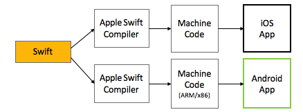

## Our Mission
Our mission is to make Swift app mobile developement on Android and iOS easy and efficient, reducing the time and cost to develop for two platforms. 

We provide a software platform to build native mobile applications for iOS and Android using the Swift programming language.

The SCADE platform contains the following main components:

- the **Swift compiler for Android** that compiles Swift source code into native Android code
- the **Swift core libraries for Android** (Foundation, libDispatch)
- the interop component **Swift4J** that makes calling the Swift code on Android super easy
- our SCADE command line interpreter to manage the compilation process

## Swift for Android compiler

Our Swift compiler takes Swift source code and compiles this into native binary image (AAR file) for the Android platform. Both x86 and ARM are supported on both 32bit and 64bit platforms

SCADE has vast experience in Swift for Android, maintaining the compiler since Version 2.0.

## Swift System Components for Android
In order to run Swift on Android, some core components have to be available in Android. We therefore ported core components to Android including Swift Foundation and Swift libDispatch.

## Swift4J

The **swift4j** toolkit is a set of libraries and tools making possible a seamless interoperability between Swift and Java/Kotlin. Swift4J includes a set of Gradle plugins and the Swift Toolchain for Android allowing smooth integration of the Swift libraries into the desktop and mobile applications written in Java/Kotlin.  See the [readme](https://github.com/scade-platform/swift4j/) for technical details

## Current version	
SCADE latest version is SCADE Applogic J25 supporting Swift 6.1 as of 3rd of July 2025.

## Our roadmap

SCADE exists for quite some time now, where in the earlier years we provided support for both UI and none UI functionality. This included our beautiful [Nimble](https://github.com/scade-platform/Nimble) IDE and SCADE graphics and UI engine.

We changed this approach to not spread ourselves too thin and focus on delivering the functionality in phases:

- Provide a platform to develop and ship non-UI application logic code written in Swift to both iOS and Android. The product name for this is AppLogic. We released the new version in Q1 2025. 

- Our next release in July 2025 provide Apple Compose support

- Additionally, we will release new versions to continuously support new versions of Swift, iOS and Android. 

